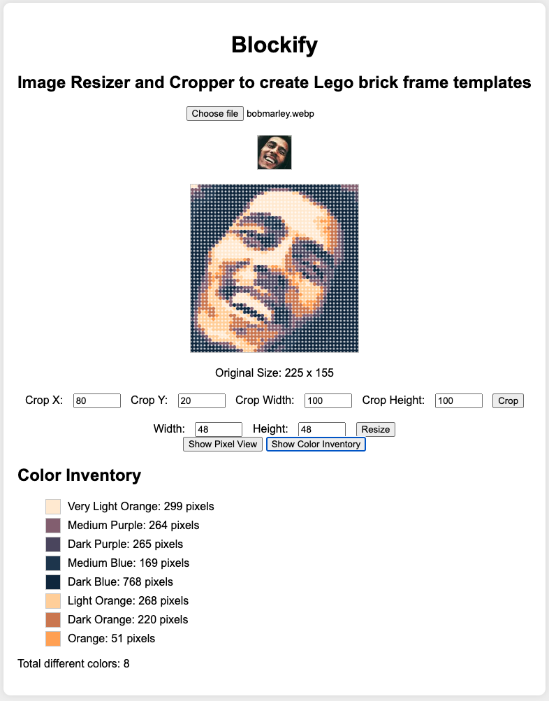

# Brickify

Brickify is a tool to create custom LEGO frames using dot-type bricks from your own photos. This UI helps you experiment with different photos and determine the colors and quantities of bricks needed.

## Features

- Upload and crop images
- Resize images to focus on the most relevant areas
- Display the output
- Generate an inventory of required colors

## Getting Started

To get started, follow these steps:

1. Go to [https://danuw.github.io/brickify/](https://danuw.github.io/brickify/)
2. Upload an image, crop it, resize it, and view the output along with the color inventory.

## Notes

- LEGO dot-type bricks are typically sold in packs of 1000, either in specific colors or mixed. Keep this in mind when selecting your palette.

## Roadmap

We welcome contributions! Here are some planned improvements:

- [x] Publish to GitHub Pages for easy access
- [ ] Selectable palettes from predefined sets
- [ ] More palette options
- [ ] Custom palettes
- [ ] Lock aspect ratio for final output
- [ ] Use 16x16 plates format for preset sizes and ratios

## Original CodePen

This project was originally created as a CodePen: [https://codepen.io/danuw/pen/WNqzeLK](https://codepen.io/danuw/pen/WNqzeLK).