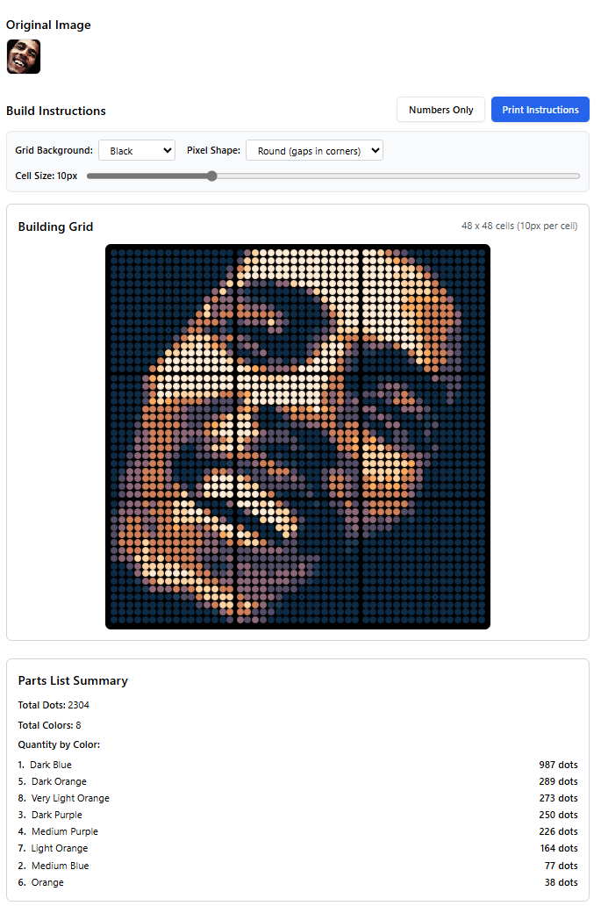

# Brickify

Brickify is a tool to create custom LEGO frames using dot-type bricks from your own photos. This UI helps you experiment with different photos and determine the colors and quantities of bricks needed.

## Features

- Upload and crop images
- Resize images to focus on the most relevant areas
- Display the output
- Generate an inventory of required colors

## Getting Started

To get started, follow these steps:

1. Go to [https://danuw.github.io/brickify/](https://danuw.github.io/brickify/)
2. Upload an image, crop it, resize it, and view the output along with the color inventory.



## Material suggestions

- black or white plates: https://s.click.aliexpress.com/e/_c44eT2l9
- or plates with a frame: https://s.click.aliexpress.com/e/_c3IgakOR
- bricks of different colours: https://s.click.aliexpress.com/e/_c4Fl1IcF

> Notes: LEGO dot-type bricks are typically sold in packs of 1000, either in specific colors or mixed. Keep this in mind when selecting your palette.

> If you choose square type bricks, the background color wont matter much - especially if you have a frame - otherwise be careful about the background colour for the overall effect.

## Dokploy Deployment

This repository is Dokploy-ready using Docker Compose.

### Required environment variables

- `PORT` (optional, default: `8080`): internal container port used by the app.
- `HOST_PORT` (optional, default: `8080`): host port mapping for direct access.

### Local Docker Compose run

```bash
docker compose up --build
```

Health check endpoint:

- `GET /health` (returns `200`)

### Dokploy setup notes

1. Create a Compose application and point it to this repository.
2. In Dokploy Domains tab, set Container Port to the same value as `PORT` (default `8080`).
3. Configure environment variables in Dokploy Environment tab:
	`PORT` and optionally `HOST_PORT`.
4. Redeploy after domain changes.

### GHCR image publishing

The repository includes two workflows:

- `.github/workflows/ghcr-main.yml`: pushes `ghcr.io/<owner>/<repo>:latest` on `main`.
- `.github/workflows/ghcr-release.yml`: pushes semantic tags on `v*.*.*` (for example `1.2.3`, `1.2`, `1`).

These workflows use `secrets.GITHUB_TOKEN` with `packages: write` permission.

## Roadmap

We welcome contributions! Here are some planned improvements:

- [x] Publish to GitHub Pages for easy access
- [x] Numbers instead of colours on the grid as clear build instructions
- [x] Selectable palettes from predefined sets
- [x] More palette options
- [x] Custom palettes
- [x] Lock aspect ratio for final output
- [ ] Use 16x16 plates format for preset sizes and ratios

## Original CodePen

This project was originally created as a CodePen: [https://codepen.io/danuw/pen/WNqzeLK](https://codepen.io/danuw/pen/WNqzeLK).